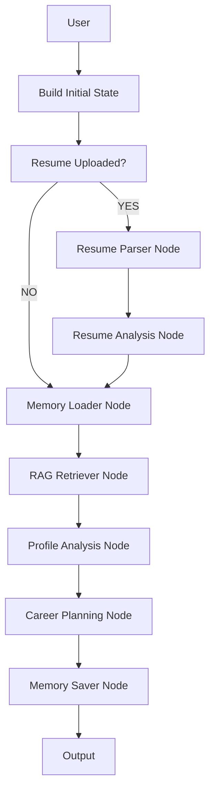
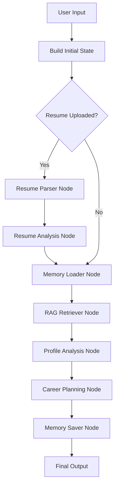

# CareerForge AI - LangGraph Architecture Deep Dive

**An AI-powered Career Guidance Assistant built with LangGraph** to demonstrate real-world, production-grade AI application architecture.

---

## Project Goal

CareerForge AI is an AI-powered Career Guidance Assistant designed to demonstrate how a complex real-world AI application can be structured using **LangGraph**.

Instead of relying on a single massive prompt sent to an LLM, the application breaks the problem into multiple specialized steps:

- Resume Parsing
- Resume Analysis
- Memory Retrieval
- Knowledge Retrieval (RAG)
- Profile Analysis
- Career Planning
- Memory Persistence

Each step is implemented as a **LangGraph node**.

---

## Why Not Use One Prompt?

A traditional AI application often looks like this:

```
User Input
     +
Resume
     +
Career Documents
     +
History

        ↓
   One Huge Prompt
        ↓
      Gemini
        ↓
     Response


This approach works for small applications but becomes difficult to **maintain, debug, scale, and extend**. If one component fails, the entire workflow becomes hard to understand.

---

## Why LangGraph?

LangGraph allows us to break the workflow into multiple specialized nodes — like a company with specialists instead of one employee doing everything.

**Instead of:**
One Employee → Everything

**We have:**
- Resume Specialist
- Knowledge Specialist
- Memory Specialist
- Career Analyst
- Career Planner

Each specialist performs one focused job and contributes information to a **shared workspace**.

---

## Core LangGraph Concepts Used

- State Management
- Nodes & Edges
- Graph Compilation
- Conditional Workflows
- Memory
- Retrieval-Augmented Generation (RAG)
- Vector Databases
- Prompt Engineering
- LLM Calls
- State Enrichment
- Workflow Orchestration

---

## High-Level Architecture



This is **not a simple linear chain**. The workflow uses conditional routing based on available data.

---

## Conditional Workflow

One of the most powerful features of LangGraph is **conditional routing**.

**Example:**

```
Resume Uploaded?
      │
   ┌──┴──┐
  YES   NO
   │     │
   ▼     │
Resume   │
Parser   │
   │     │
   ▼     │
Resume   │
Analysis │
   │     │
   └─────┴─────► Continue Flow
```

---

## State Management

State is the **heart of LangGraph**. Think of it as a shared notebook passed between all nodes.

### State Definition

```python
class CareerState(TypedDict):
    skills: str
    interests: str
    experience: str
    goals: str
    resume_path: str
    resume_text: str
    resume_analysis: str
    memory_context: str
    retrieved_context: str
    profile_analysis: str
    career_paths: str
    roadmap: str
    projects: str
    interview_prep: str
    learning_resources: str
```

### State Evolution

- **Initial State**: `skills`, `interests`, `goals`, `resume_path`
- **After Resume Parser**: + `resume_text`
- **After Resume Analysis**: + `resume_analysis`
- **After Memory Loader**: + `memory_context`
- **After RAG Retriever**: + `retrieved_context`
- **After Profile Analysis**: + `profile_analysis`
- **After Career Planning**: + `career_paths`, `roadmap`, `projects`, `interview_prep`, `learning_resources`

This progressive building of information is called **State Enrichment**.

---

## Node Architecture

Every node follows the same pattern:

```python
def node_name(state: CareerState):
    # Read from state
    # Process / Call LLM / Load data
    # Return updates
    return {"new_field": value}
```

### Key Nodes

**Resume Parser Node**  
- Converts PDF to text using PyPDF  
- **No LLM call** (preprocessing)

**Resume Analysis Node**  
- Analyzes strengths, weaknesses, missing skills, suitable roles  
- First LLM-powered node

**Memory Loader Node**  
- Loads previous career sessions from `career_history.json`

**RAG Retriever Node**  
- Retrieves relevant knowledge from ChromaDB vector database

**Profile Analysis Node**  
- Combines user input + resume + memory + RAG knowledge

**Career Planning Node**  
- Generates final recommendations: career paths, roadmap, projects, interview prep, resources

**Memory Saver Node**  
- Persists session results for future personalization

---

## What is RAG?

**RAG = Retrieval Augmented Generation**

The LLM is augmented with external, relevant knowledge instead of relying only on its training data.

### RAG Pipeline

1. Documents → Chunking → Embeddings → ChromaDB
2. User query → Retrieve similar chunks → Add to prompt

---

## LLM Call Flow

Not every node calls the LLM — this improves efficiency and reduces cost:

- **Resume Parser**: ❌ No LLM
- **Resume Analysis**: ✅ LLM
- **Memory Loader**: ❌ No LLM
- **RAG Retriever**: ❌ No LLM
- **Profile Analysis**: ✅ LLM
- **Career Planning**: ✅ LLM
- **Memory Saver**: ❌ No LLM

---

## Graph Compilation

```python
career_graph = graph_builder.compile()
```

The compiled graph becomes an **executable workflow** that LangGraph can run end-to-end.

---

## Final Mental Model

Imagine a **team of specialists** collaborating:

- Resume Specialist
- Memory Specialist
- Knowledge Specialist
- Career Analyst
- Career Planner
- Historian

**LangGraph** is the orchestration layer that coordinates their collaboration and produces a comprehensive, personalized career guidance report.

---

# Installation & Setup Guide

## 1. Clone The Repository

```bash
git clone https://github.com/<your-username>/careerforge-ai.git
cd careerforge-ai
```

## 2. Create Virtual Environment

### Windows
```bash
python -m venv venv
venv\Scripts\activate
```

### Linux / Mac
```bash
python -m venv venv
source venv/bin/activate
```

## 3. Install Dependencies

```bash
pip install -r requirements.txt
```

## 4. Configure Environment Variables

Create a `.env` file in the root directory:

```env
GOOGLE_API_KEY=YOUR_GEMINI_API_KEY
```

Get your API key from: [https://aistudio.google.com](https://aistudio.google.com)

## 5. Prepare Memory Store

```bash
mkdir memory
```

Create `memory/career_history.json` with:

```json
[]
```

## 6. Prepare Knowledge Base

Create a `knowledge_base/` folder and add career-related PDFs:

```
knowledge_base/
├── AI_Engineer_Roadmap.pdf
├── Machine_Learning_Guide.pdf
├── Interview_Preparation.pdf
└── Data_Science_Roadmap.pdf
```

## 7. Build The Vector Database

```bash
python scripts/ingest_documents.py
```

This will create the `vector_store/` directory with ChromaDB files.

## 8. Run The Application

```bash
python app.py
```

Open your browser and go to: `http://127.0.0.1:5000`

---

# First Test Run

1. Fill in the form:
   - **Skills**: Python, SQL
   - **Interests**: Artificial Intelligence
   - **Experience**: Beginner
   - **Goal**: AI Engineer
2. (Optional) Upload a Resume PDF
3. Click **Generate Career Roadmap**

The system will execute the full LangGraph workflow and return personalized career paths, roadmap, projects, interview preparation, and learning resources.

---

# How Information Flows Through The System



This diagram clearly shows the **conditional branching** at the "Resume Uploaded?" decision point — the core strength of LangGraph.

---

# What This Project Demonstrates

## LangGraph
- State Management
- Nodes & Edges
- Graph Compilation
- Conditional Routing
- Multi-Step AI Workflows
- State Enrichment
- Workflow Orchestration

## LangChain
- Prompt Templates
- LLM Integration
- Embeddings
- Document Loaders
- Text Splitters
- Retrievers

## RAG
- Knowledge Base Creation
- Vector Embeddings
- ChromaDB
- Semantic Search

## AI Engineering Best Practices
- Resume Intelligence
- Persistent Memory
- Modular AI Architectures
- Context-Aware Recommendations

---

**Built with LangGraph • LangChain • Gemini • ChromaDB • PyPDF**
